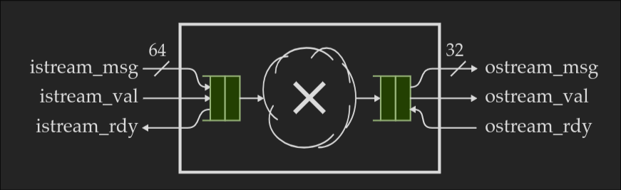
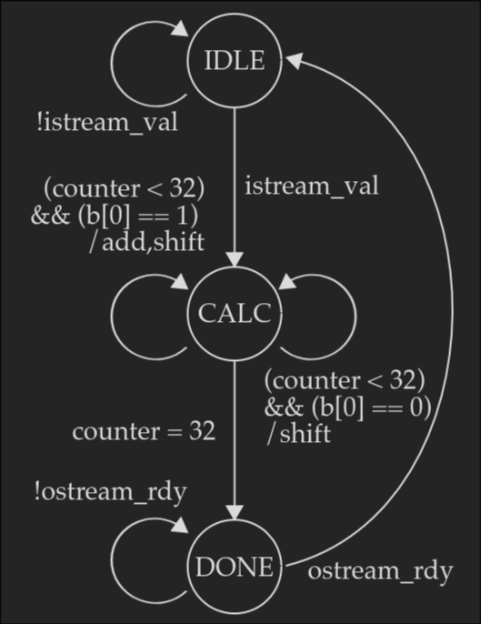
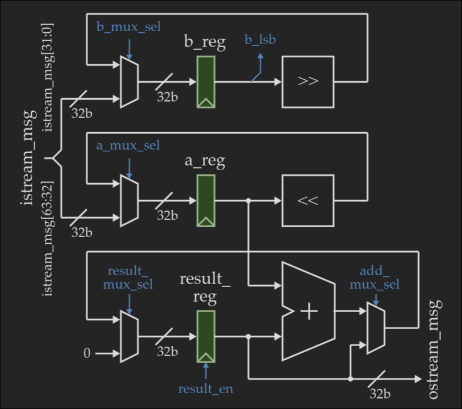

# Variable Latency 32-bit Iterative Multiplier

This repository contains a 32-bit iterative integer multiplier that handles both signed and unsigned two's complement numbers using a shift-and-add algorithm. The design improves upon standard fixed-latency iterative multipliers by skipping continuous chains of zeros during computation.

## Interface Protocol (val/rdy)

The module encapsulates its variable execution time using a latency-insensitive `val/rdy` (valid/ready) stream interface. 
*   **Encapsulation:** The internal cycle latency is completely hidden from the external system to maintain a clean boundary.
*   **Handshake:** The multiplier only accepts 64-bit input operands when `istream_rdy` is high and asserts `ostream_val` only when the final 32-bit product is ready.

## The Sparse Counter Optimization

The baseline architectural reference uses a fixed ~35 cycle execution path. This implementation reduces total clock cycles using a custom Sparse Counter (`sparse_counter.v`).
*   The counter uses combinational logic to dynamically inspect the multiplier register (`b_reg`) and locate the bit position of the next `1`.
*   Instead of shifting by a single bit per cycle, the datapath shifts both the multiplicand and multiplier by the calculated `sparse_count` simultaneously.
*   This allows the execution state to skip long sequences of `0`s in a single clock cycle, dynamically adapting the latency based on the structure of the input operands.

## Microarchitecture Breakdown

The design is partitioned into a strict datapath and control unit, wrapped in a top-level module.

*   **`imul_main.v` (Top Wrapper):** Manages two's complement signed arithmetic. It records the signs of the 64-bit input stream, converts both operands to positive magnitudes for the core datapath to process, and reapplies the correct sign to the final 32-bit output.
*   **`data_path.v`:** Contains the accumulator (`r_reg`), multiplicand register (`a_reg`), and multiplier register (`b_reg`). It applies dynamic shifts (`<< sparse_count` and `>> sparse_count`) and routes the partial sum back to the accumulator.
*   **`control_unit.v`:** A Mealy Finite State Machine (FSM) that drives multiplexer selects and register enables. It cycles through IDLE (`s1`), LOAD (`s0`), CALC (`s2`), and DONE (`s3`) states based on the `val/rdy` handshake and the execution counter.

  

 

  

## Simulation & Debugging

The module is simulated using **Icarus Verilog** and debugged with **GTKWave**. 

A self-checking testbench (`testbench.v`) is included to verify the datapath. It covers standard operations, zero multiplication, and signed bounds (e.g., negative by negative), outputting simple PASS/FAIL logs directly to the console.

## Repository Structure

*   **`docs/`**: Architecture reference diagrams and resources.
*   **`imul_main.v`**: Top-level wrapper managing signed operations.
*   **`control_unit.v`**: FSM for datapath routing and handshaking.
*   **`data_path.v`**: Core shift-and-add datapath logic.
*   **`sparse_counter.v`**: Combinational zero-skipping logic.
*   **`testbench.v`**: Self-checking Verilog simulation environment.
